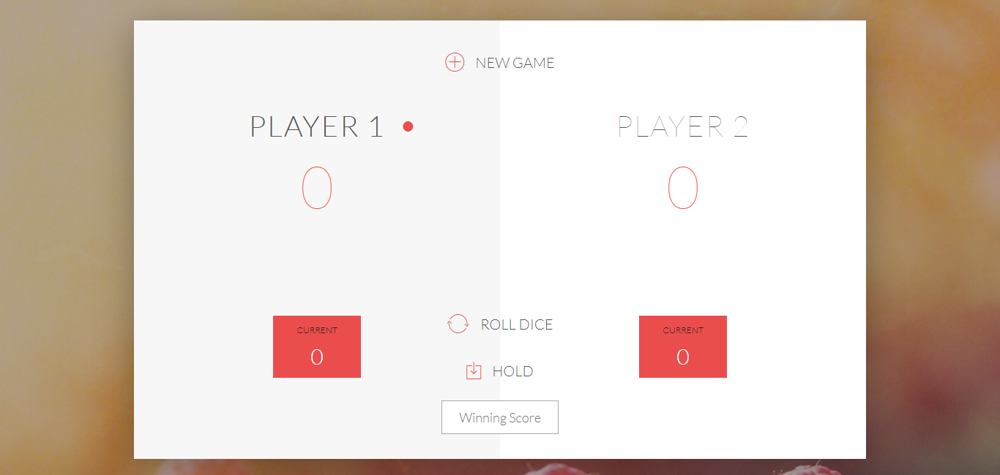
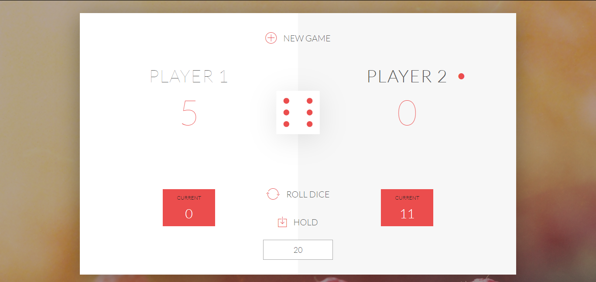
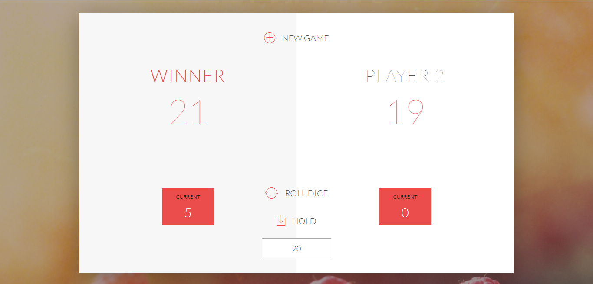

# Pig-Game

A simple Pig Game using Javascript, HTML and CSS.

<h2>GAME RULES:</h2>

- The game has 2 players, playing in rounds
- In each turn, a player rolls a dice as many times as he whishes. Each result get added to his ROUND score
- BUT, if the player rolls a 1, all his ROUND score gets lost. After that, it's the next player's turn
- The player can choose to 'Hold', which means that his ROUND score gets added to his GLBAL score. After that, it's the next player's turn
- You can set the winning score and first who will reach to the winning score, will win the game.

